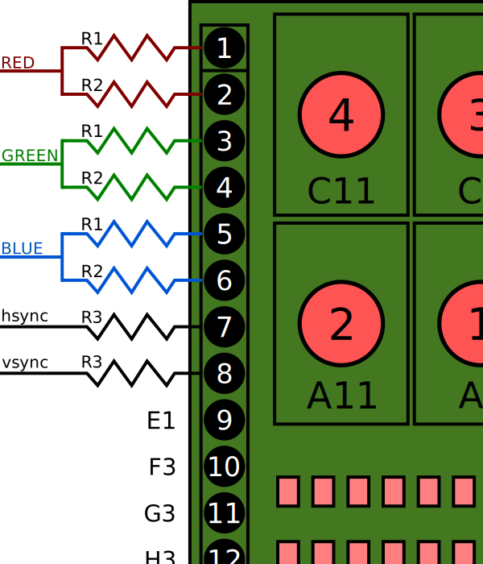

# JumpCone game

This project is a simple game I built to play around with VGA graphics.
You control a traffic cone, and the goal is to jump onto the head of the Duke of Wellington statue.

## Connections

The connections between the VGA cable and the icefun board are as shown here:

With ground (not shown) connected to PIN 28 (labeled GND on the board).

The resistor values are:
 - R1 (x3) : 500 Ω
 - R2 (x3) : 1 kΩ
 - R3 (x2) : 47 Ω

This connection allows up to 64 different colours to be displayed.
Adding more connections to each colour (with appropriate resistors) may allow more colours, but I have not explored this.

## Building

Build the project with `make` and program the board with `make burn`

## Controls

Move the cone left and right with buttons 2 and 1.
Jump using button 3.

## Graphics

Graphics are read from `mif` files containing the image data in binary format.
These files were generated from `png` images using the `image-convert.py` script in the script directories.

## VHDL file overview

### jumpcone_top.vhd

This file contains the top module of the project.
It links together the graphics drawing and the physics calculations

### move_1D.vhd

This module controls movement in 1 dimention.
If gravity is enabled via generic, the object will 'fall' in the +tive direction until it hits an obstruction.
Without gravity, the object moves forward and backward depending on the inputs it recieves.

### drawImage.vhd

This module draws an image read from a `mif` file onto the screen.

### simple_480p.vhd

This module creates the horizontal and vertical sync signals and defines the drawing area of the screen.

### pll.vhd

A pll to convert the 12 MHz base clock to 25.175 MHz as required by the VGA standard.
(actually, it can only produce 25.125 MHz, but that seems to work well enough)

## Acknowledgments

This project was inspired by github user robin7g's [vga projects](https://github.com/robin7g/rg-iceFUN) on the iceFun board.
It was from that repository that I got the pin connections for the VGA cable.

Additionally, I found Project F's tutorial on [fpga graphics](https://projectf.io/posts/fpga-graphics/) to be very useful for working out how to draw on VGA.